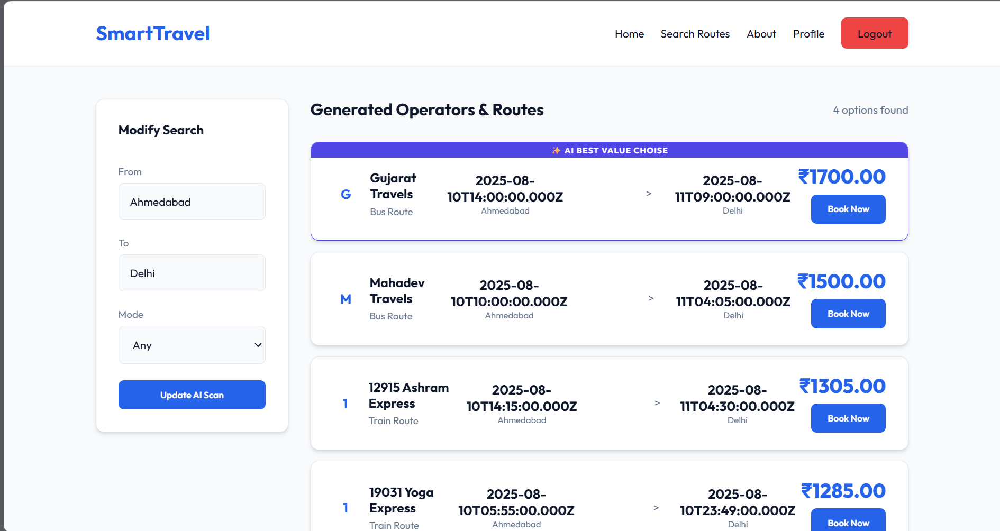

# SmartTravel

## Project overview
SmartTravel (formerly SmartTravel) is an AI-powered, modern travel booking platform designed to provide a seamless user experience. It helps users find and book flights, buses, and trains across multiple operators using predictive AI and a responsive, dynamic user interface.

## Features
- **AI-Powered Recommendations:** Get smart travel suggestions based on data and trends.
- **Multi-Operator Booking:** Search options across different modes of transport (Flights, Trains, Buses).
- **Secure User Authentication:** Registration, login, and password resets using JWT & Bcrypt.
- **Image Management:** Seamless image uploads and hosting leveraging Cloudinary.
- **Modern & Responsive UI:** Built with Vanilla HTML/CSS/JS with a focus on user engagement and smooth micro-animations.

## Screenshots

### Homepage
*(Add your homepage screenshot here)*


### Route selection
*(Add your route selection screenshot here)*


### Booking flow
*(Add your booking flow screenshot here)*


### Payment page
*(Add your payment page screenshot here)*


### Confirmation
*(Add your confirmation screenshot here)*


## Folder structure

```text
SmartTravel/
├── backend/                  # Node.js Express server
│   ├── db/                   # Database logic
│   ├── uploads/              # Local temp storage for multer
│   ├── server.js             # API entry point
│   ├── .env                  # Environment secrets (ignored)
│   └── package.json          # Node dependencies
└── frontend/                 # Static web client
    ├── index.html            # Landing and AI picks
    ├── search.html           # Route querying
    ├── payment.html          # Payment UI
    ├── login.html            # Authentication
    ├── profile.html          # User account management
    ├── styles.css            # Centralized CSS classes
    └── nav.js                # App navigation routing
```

## Future scope
- **Real-Time Seat Maps:** Visual layout for users to select accurate seating arrangements.
- **Third-party Payment APIs:** Transition from standard mockups to active payment gateways like Stripe or Razorpay.
- **Live Notifications & Emails:** Distribute digital e-tickets instantly after transaction success.
- **Mobile Adaptation:** Expand functionality directly to an iOS/Android native app format.

## Run locally

1. **Clone the repository:**
   ```bash
   git clone https://github.com/your-username/SmartTravel.git
   cd SmartTravel
   ```

2. **Setup the Database & Backend:**
   ```bash
   cd backend
   npm install
   ```
   Create a `.env` file in the `backend` directory and add your credentials:
   ```env
   HOST=localhost
   USER=root
   PASSWORD=your_mysql_password
   DATABASE=SmartTravel_db
   JWT_SECRET=your_jwt_secret
   CLOUDINARY_CLOUD_NAME=your_cloudinary_name
   CLOUDINARY_API_KEY=your_cloudinary_api_key
   CLOUDINARY_API_SECRET=your_cloudinary_api_secret
   ```
   Run the SQL migration script (if you have one) to create the tables natively, then start the server:
   ```bash
   npm start
   ```
   *The backend will boot up on `http://localhost:4000`.*

3. **Frontend Startup:**
   Because the frontend is running purely on Vanilla HTML/CSS/JS, you can serve it easily from your terminal. Open a new terminal from the root of the project and run:
   ```bash
   npx serve frontend
   ```
   *This will serve the frontend on a local port (usually `http://localhost:3000`). Make sure your backend logic is running concurrently.*

## Tech stack
- **Frontend:** HTML5, CSS3, JavaScript (Vanilla)
- **Backend:** Node.js, Express.js
- **Database:** MySQL
- **Authentication:** JSON Web Tokens (JWT), Bcrypt.js
- **Media Hosting:** Cloudinary (Integrated with Multer)
